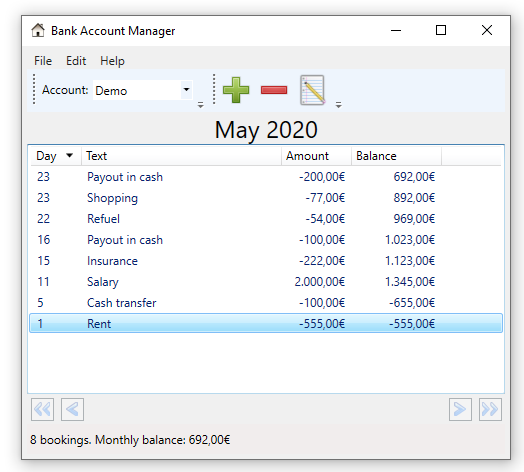
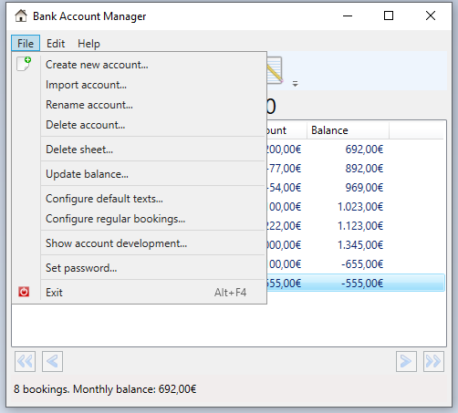
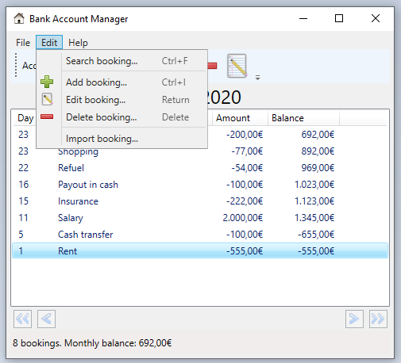
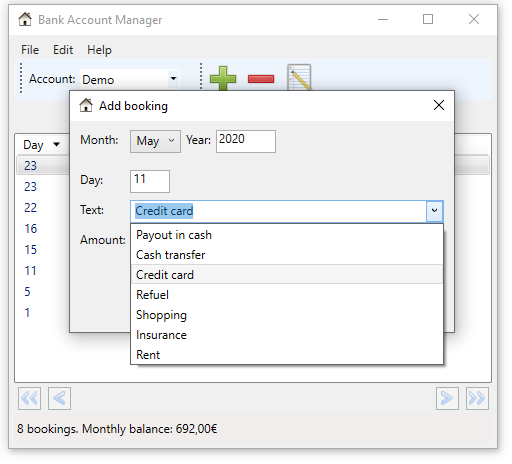
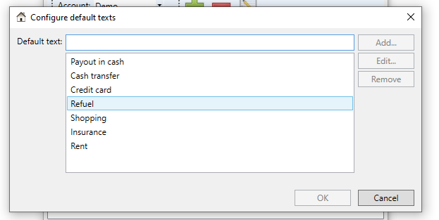
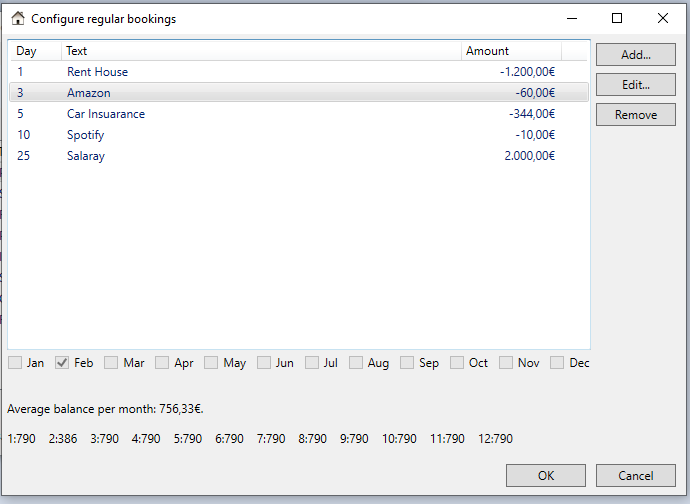

# Myna Bank

## Overview

An application to manage bank accounts for Windows using WPF.

## Installation

The latest MSI file can be found here: https://github.com/nylssoft/MynaBank/releases/download/v1.0.5.1/MynaBank.msi

The program requires .NET framework v4.7.

## Screenshots

### File Menu Item

### Edit Menu Item

### Add Booking

### Configure Default Texts

### Configure Regular Bookings

## Build

- Build with VS 2017
- WiX ToolSet is required to build a MSI, see https://http://wixtoolset.org/

## Licenses

The following icons are used from the **Open Icon Library** (https://sourceforge.net/projects/openiconlibrary):

application-exit-5.png / nuovext2 / LGPL-2.1 
arrow-left-2.png / nuvola / LGPL-2.1 
arrow-left-double-2.png / nuvola / LGPL-2.1 
arrow-right-2.png / nuvola / LGPL-2.1 
arrow-right-double-2.png / nuvola / LGPL-2.1 
document-decrypt-3.png / oxygen / CC-BY-SA 3.0 or LGPL 
document-encrypt-3.png / oxygen / CC-BY-SA 3.0 or LGPL 
document-new-6.ico / oxygen / CC-BY-SA 3.0 or LGPL 
document-open-2.png / echo / CC-BY-SA-3.0 
document-properties-2.png / gnome / GPLv2 
document-save-7.png / nuovext2 / LGPL-2.1 
document-save-as-6.png / nuovext2 / LGPL-2.1 
edit.png / gimp / GPLv2 
edit-copy-7.png / famfamfam-silk / CC-BY-2.5 or CC-BY-3.0 
go-home-8.ico / nuovext2 / LGPL-2.1 
go-home-10.png / nuovext2 / LGPL-2.1 
homepage.png / nuvola / LGPL-2.1 
key.png / famfamfam-silk / CC-BY-2.5 or CC-BY-3.0 
kgpg_info.png / nuvola / LGPL-2.1 
list-add-4.ico / oxygen / CC-BY-SA 3.0 or LGPL 
list-remove-4.ico / oxygen / CC-BY-SA 3.0 or LGPL 
